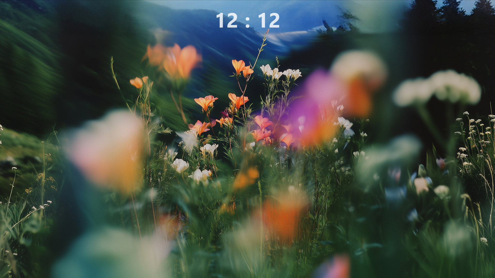
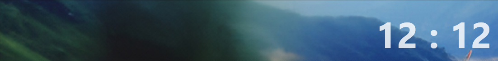

# Yuno's-Rainmeter-Clock
A simple rainmeter skin that displays time on your desktop.

# Suggested actions
Enable "Click through" from the Rainmeter dashboard.
\(The ClickThrough for the skin has been set to 1, but Rainmeter may not reflect that. May require manually enabling clickthrough).

# Changing Time Zone
The Rainmeter dahboard has an "Edit" option. Click on the edit option and change the TimeZone variable in both \[MeasureHour] and \[MeasureMinute]. Default set to GMT.
This variable can also be changeed in the Variables file available from `@Resources` > `variables.inc`.

**How to change?** >> To set time zone, use +/- hours from GMT. In case there is a half-hour or so difference, for instance +1.30 GMT, use +1.5.

# Screenshots

